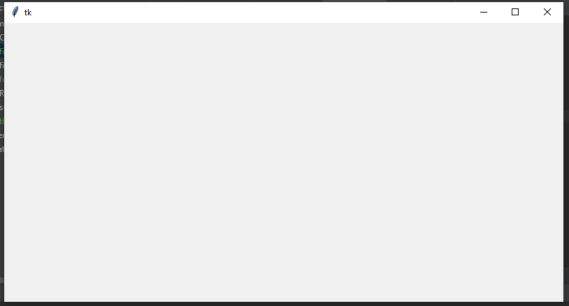
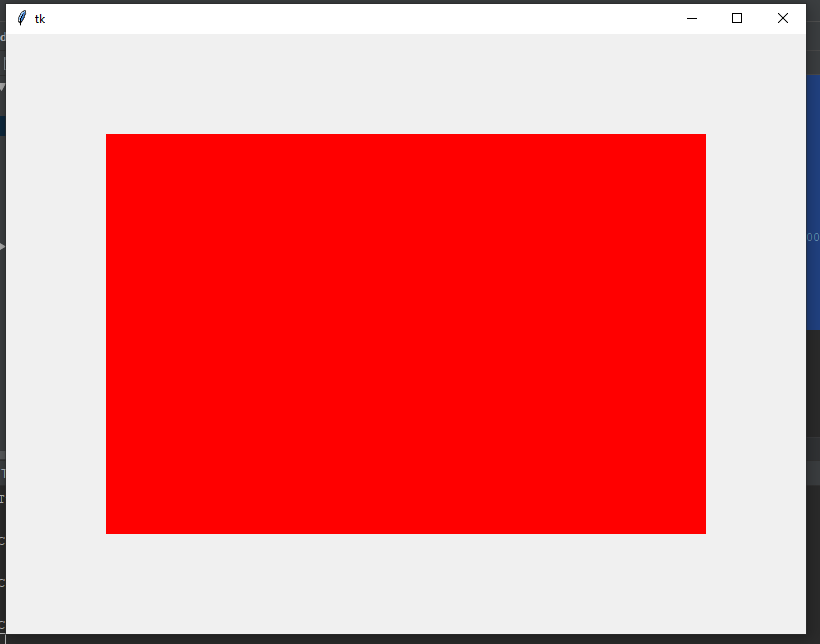
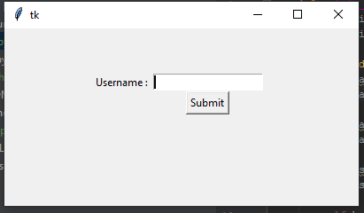

# Python-Tkinter-Frame

<code>first.py</code>

<h3>Screenshot</h3>

<code>second.py (Using Classes and Objects)</code>
<h3>Screenshot</h3>

<code>third.py (Window Resize)</code>
<h3>Screenshot</h3>

<code>fourth.py (window with Frame)</code>
<h3>Screenshot</h3>

<code>fifth.py (window with Frame + widgets)</code>
<h3>Screenshot</h3>

<code>sixth.py (button click listener)</code>
<h3>Screenshot</h3>

